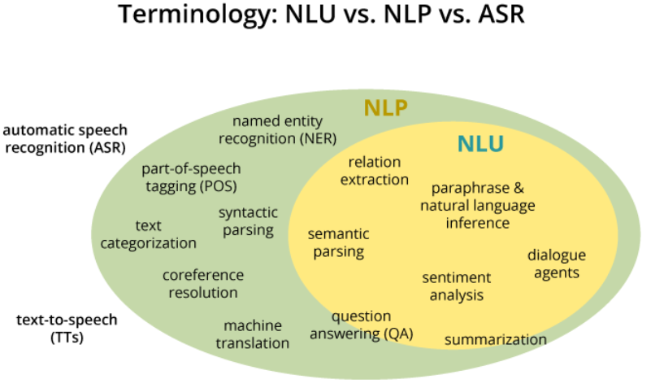
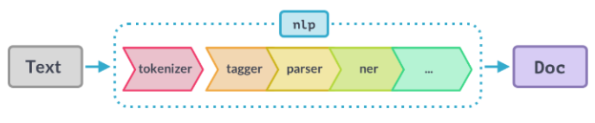

# Awesome NLP (DevGun) 🇰🇷

<p align="center">
    
</p>
<br/>





<br/>

<br/>

## Table of Contents

- **Korean Morpheme Analyzer**
  - **KakaoBrain PORORO**
- **Tokenizer**
  - **BERT Tokenizer**
- **Topic Modeling (토픽 모델링)**
  - **LSA (Latent Semantic Analysis, 잠재 의미 분석)**
- **Text Classification**
  - **Multi-Class Text Classification with Doc2Vec & Logistic Regression**

<br/>

<br/>

<br/>

# Korean Morpheme Analyzer

<br/>

## # KakaoBrain PORORO

> **Platform Of neuRal mOdels for natuRal language prOcessing**
>
> ***https://github.com/kakaobrain/pororo***

`pororo` performs Natural Language Processing and Speech-related tasks.

It is easy to solve various subtasks in the natural language and speech processing field by simply passing the task name.

<br/>

### PORORO Instructions (Install virtual environment In Windows10)

```bash
# Run Windows Terminal as administrator

# Creating a virtual environment
> python -m venv venv
> .\venv\Scripts\Activate.ps1
> python -m pip install --upgrade pip
> pip install -r requirements.txt

> git clone https://github.com/pytorch/fairseq
> cd .\fairseq\
> pip install --editable ./

> git clone https://github.com/kakaobrain/pororo.git
> cd .\pororo\

# PORORO
# MODIFY setup.py
# long_description=open("README.md", 'rt', encoding='UTF8').read(),
> pip install --editable ./

# Shut down the virtual environment
> deactivate
```

<br/>

<br/>

<br/>

# Topic Modeling (토픽 모델링)

<br/>

## # LSA (Latent Semantic Analysis, 잠재 의미 분석)

> https://wikidocs.net/24949

LSA는 정확히는 토픽 모델링을 위해 최적화 된 알고리즘은 아니지만, 토픽 모델링이라는 분야에 **아이디어를 제공**한 알고리즘이라고 볼 수 있다. 

LDA(Latent Dirichlet Allocation)는 LSA의 단점을 개선하여 탄생한 알고리즘으로 토픽 모델링에 보다 적합한 알고리즘이다.

BoW(Bag of Words)에 기반한 DTM(Document-Term Matrix)이나 TF-IDF(Term Frequency-Inverse Document Frequency)는 기본적으로 단어의 빈도 수를 이용한 수치화 방법이기 때문에 단어의 의미를 고려하지 못한다는 단점이 있었다.

